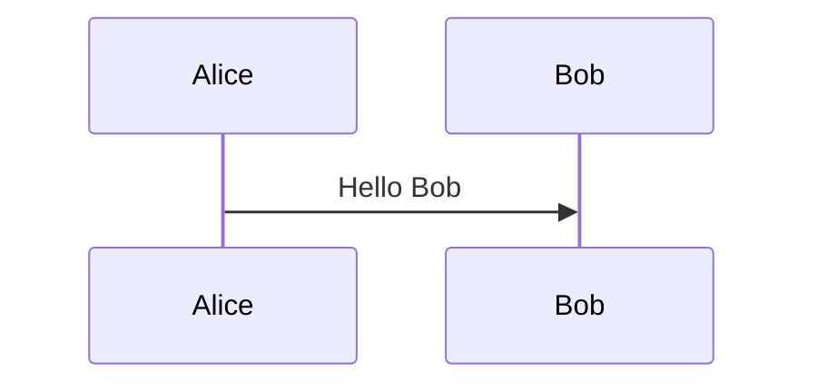

通过 Hugo 搭建的静态页面，改页面用于参考以及验证模版提供的基础能力，包括了 Markdown 语法、图片、扩展等等，基础语法还可以参考 [CommonMark](https://commonmark.org/help/)。

<!--more-->

# 目录 1

## 目录 2

### 目录 3

#### 目录 4

##### 目录 5

###### 目录 6

# 字体

*这是斜体*，这 _还是斜体_。

**粗体** 以及 __还是粗体__ 。

~~中间被画了个横线~~。

代码可以使用 `printf()` 或者 <code>print()</code> 函数。

``这里会显示反引号 (`)``

<!--
Water is H<sub>2</sub>O. 4<sup>2</sup>=16. 上标、下标测试。

The New York Times <cite>(That’s a citation)</cite>. 引用测试，和斜体相似。

This is <u>Underline</u>. 下划线。
-->

# 分割线

下面的效果是相同的。

* * *

***

*****

- - -

---------------------------------------

# 段引用

单段的引用。

> My conclusion after the trip was "well, now I know that there's at least one company in the world that can succeed with the waterfall model" and I decided to stop bashing the waterfall model as hard as I usually do. Now, however, with all the problems Toyota are having, I'm starting to reconsider.q q q q q q q q q q q q q q q<from>kkkkk</from>

多段的引用。

> My conclusion after the trip was "well, now I know that there's at least one company in the world that can succeed with the waterfall model" and I decided to stop bashing the waterfall model as hard as I usually do. Now, however, with all the problems Toyota are having, I'm starting to reconsider.
>
> My conclusion after the trip was "well, now I know that there's at least one company in the world that can succeed with the waterfall model" and I decided to stop bashing the waterfall model as hard as I usually do. Now, however, with all the problems Toyota are having, I'm starting to .q q q q q

单段，但较为复杂的引用。

> My conclusion after the trip was "well,
> now I know that there's at least one company in the world
> that can succeed with the waterfall model" and I decided to
> stop bashing the waterfall model as hard as I usually do.
> Now, however, with all the problems Toyota are having, I'm starting to reconsider.

嵌套引用。

> My conclusion after the trip was "well,
> now I know that there's at least one company in the world
> > that can succeed with the waterfall model" and I decided to
> stop bashing the waterfall model as hard as I usually do.
> Now, how ever, with all the problems Toyota are having, I'm starting to re consider.

# 引用

如下是一个简单的链接 [an example](http://example.com/ "Title")，当然也可以使用网站的相对路径 [About Me](/about/) 。

也可以将网站的引用与 URL 分别区分开，如下是其中的示例，而且不区分大小写，[RTEMS][1]、[Linux][2]、[GUN][GUN]、[GUN][gun] 。

<!-- the following can occur on anywhere -->
[1]: http://www.rtems.com                              "A Real Time kernel"
[2]: http://www.Linux.com                              'Linux'
[Gun]: http://www.gun.com                              (GUN)

# 列表

## 无序列表

- level 1 item
  - level 2 item
  - level 2 item
    - level 3 item
    - level 3 item
- level 1 item
  - level 2 item
  - level 2 item
- level 1 item
  - level 2 item
- level 1 item

可以通过 `*` `-` `+` 几种方式表示无序列表。注意，如果列表之前采用了换行，那么各项之间会表示为段落，也就是说添加了 `<p` ，导致看起来各个段之间空隙有点大。

- Item one

- Item two

- Item three

## 有序列表

有序表的表达方式，只与顺序相关，而与列表前的数字无关，最多支持两层嵌套。

1. Item one
   1. sub item one
   2. sub item two
   3. sub item three
2. Item two

## 使用技巧

列表项目标记通常是放在最左边，但是其实也可以缩进，最多 3 个空格，项目标记后面则一定要接着至少一个空格或制表符。

*   Hello
    World
    !!!
*   Hey
    Andy

如下显示相同。

*   Hello
World
!!!
*   Hey
Andy

如下是在同一列表中，显示两个段落。

1.  Hello
    World
    !!!

    Hey
    Andy

# 图片

默认图片会在内部居中显示，即使图片很大，仍可以确保在页面内显示。


还可以设置高度或者宽度，支持 `%` 方式，如下会渲染为 `` 图片。


如下因为添加了 `title` 信息会使用 `<figure>` 展示。


默认居中显示，还可以设置浮动到左或者右。


<!---->
<!-- 还需要一些文本数据。 -->
<!---->
<!-- 否则会图片可能会移动到下一个段落。 -->
<!---->
<!-- 这也就是浮动带来的问题。 -->

<!--


====> The following not work
{: .pull-center width="420"}
-->

# 表格

只需要设置好 `table` `thead` `tbody` `th` `tr` `td` 对应的属性即可。

| head1        | head two          | three |
|:-------------|:-----------------:|:------|
| ok           | good swedish fish | nice  |
| out of stock | good and plenty   | nice  |
| ok           | good `oreos`      | hmm   |
| ok           | good `zoute` drop | yumm  |

# 代码高亮显示

基础语言高亮显示。

``` c
int main()
{
	return 0;
}
```

``` javascript
// Javascript code with syntax highlighting.
var fun = function lang(l) {
  dateformat.i18n = require('./lang/' + l)
  return true;
}
```

带有行号并设置高亮显示，同时代码宽度超过显示区域。

``` css {linenos=table,hl_lines=[2,"5-7"],linenostart=199}
#container {
	float: left;
	margin: 0 -240px 0                                                                                                               0;
	width: 100%;
}
#container {
	float: left;
	margin: 0 -240px 0 0;
	width: 100%;
}
```

代码宽度超过显示区域单行显示。

```
Long, single-line code blocks should not wrap. They should horizontally scroll if they are too long. This line should be long enough to demonstrate this.
```

非高亮显示。

    <div id="awesome">
        <p>This is great isn't it?</p>
    </div>

当屏幕太窄时采用滑动方式，防止代码换行导致不便于查看。

# 扩展功能

## 任务列表

- [ ] Task A
- [x] Task B
- [ ] Task C
- [ ] Task D

## 数学表达式

这里会使用 [Katex](https://katex.org/) 渲染，如下是一个数学表达式。

$$
x=\frac{-b\pm\sqrt{b^2-4ac}}{2a}
$$

段内插入 LaTeX 代码是这样的：$\exp(-\frac{x^2}{2})$，试试看看吧。

常用的符号可以参考 [Latex Symbols](https://www.cmor-faculty.rice.edu/~heinken/latex/symbols.pdf) 或者 [本地文档](reference/symbols.pdf)，还包括了 [Equation Editor](https://editor.codecogs.com)、[MathJax Demo](https://mathjax.org/#demo) 在线编辑工具。当前主要使用 Katex 作为渲染引擎，其中文档可以参考 [Supported](https://katex.org/docs/supported.html) 以及 [Demo](https://katex.org/#demo) 示例。

另外，在使用 `\\` 换行时因为 Markdown 渲染会有问题，需要使用 `\\\` 才可以，不过在 [0.122.0](https://github.com/gohugoio/hugo/releases/tag/v0.122.0) 中进行了修复，使用时注意版本。

# Short Codes

Hugo 内置了很多常用的 [Short Codes](https://gohugo.io/content-management/shortcodes/) 实现，例如 QR、Figure 等等，这里简单梳理当前模版自定义的实现。除了 `Tabs` 之外，其它都支持 ShortCodes 和 markup 渲染。

## Mermaid

[Hugo Diagrams](https://gohugo.io/content-management/diagrams/) 默认支持 GoAT 模式，这里添加了对 [Mermaid](https://mermaid.js.org/) 支持，也可以使用 [在线编辑](https://mermaid.live/edit) 页面。


sequenceDiagram
Alice ->> Bob: Hello Bob
note over Bob: Who's this?
Bob ->> Alice: Hey
Alice ->> Alice: Work now
loop Working
    Bob ->> Alice: Task A
    Bob ->> Alice: Task B
    Alice ->> Bob: Finish B
    Alice ->> Bob: Finish A
end


除了传统的 ShortCode 方式，还可以通过代码段方式使用，这里通过 `_markup` 方式实现。

``````

``````

## Details

基础简单示例，只包含标题和内容，默认关闭。


It's a short cordes for detail information.


也可以设置打开参数，此时需要指定 `title` 和 `open` 参数。


It's a short cordes for detail information.


或者类似如下方式。

``` details {title="Details info",open=true}
Just like codes
```

## Notice

用于展示一些提示信息。


备注或者提示一些相关的信息，显示常用的一些使用技巧相关内容，例如采用某种方式的效果更好。



某些内容的说明或者提示信息，例如一些文档、资料外的信息可以提供给用户参考，可能会涉及的原始内容比较多，这里仅整理简略内容，例如一些简单示例代码：

``` c
int main() {
    puts("Hello World!!!");
}
```



提示需要特别注意的内容，例如：
* 版本发生了重大变更，可能会影响到用户使用。
* 操作时需要注意，不当可能会导致重大影响。



太危险，不要删除根目录。


## Tabs

其中在 `tabs` 中需要通过 `id` 标识不同的标签信息，如果不指定则会默认生成，同时在每个 `tab` 中需要确保存在 `label` 用于显示，同时用 `selected="true"` 标识默认显示那个标签页，也可直接 `tab "Go" "selected"` 这种方式指定。



``` python
def hello():
    print("Hello, World!")
```



``` javascript
function hello() {
    console.log("Hello, World!");
}
```



``` go
func hello() {
    fmt.Println("Hello, World!")
}
```



## Others

示例代码仓库 [test/file.txt](/test/file.txt) 。
