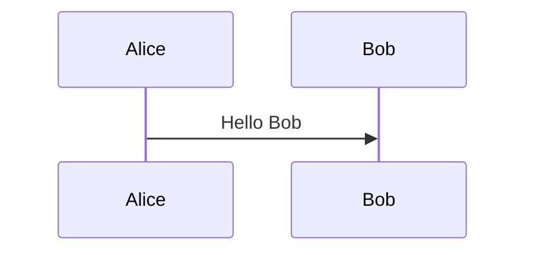

A static site built with Hugo. This page serves as a reference and test for the basic features provided by the template, including Markdown syntax, images, extensions, and more. For basic syntax, you can also refer to [CommonMark](https://commonmark.org/help/).

<!--more-->

# Heading 1

## Heading 2

### Heading 3

#### Heading 4

##### Heading 5

###### Heading 6

# Text Formatting

*This is italic*, and _this is also italic_.

**Bold text** and __also bold__.

~~Strikethrough text~~.

Code can use the `printf()` or <code>print()</code> function.

``This will display backticks (`)``

<!--
Water is H<sub>2</sub>O. 4<sup>2</sup>=16. Subscript and superscript test.

The New York Times <cite>(That's a citation)</cite>. Citation test, similar to italic.

This is <u>Underline</u>. Underline.
-->

# Horizontal Rules

The following are equivalent.

* * *

***

*****

- - -

---------------------------------------

# Blockquotes

Single paragraph blockquote.

> My conclusion after the trip was "well, now I know that there's at least one company in the world that can succeed with the waterfall model" and I decided to stop bashing the waterfall model as hard as I usually do. Now, however, with all the problems Toyota are having, I'm starting to reconsider.q q q q q q q q q q q q q q q<from>kkkkk</from>

Multi-paragraph blockquote.

> My conclusion after the trip was "well, now I know that there's at least one company in the world that can succeed with the waterfall model" and I decided to stop bashing the waterfall model as hard as I usually do. Now, however, with all the problems Toyota are having, I'm starting to reconsider.
>
> My conclusion after the trip was "well, now I know that there's at least one company in the world that can succeed with the waterfall model" and I decided to stop bashing the waterfall model as hard as I usually do. Now, however, with all the problems Toyota are having, I'm starting to .q q q q q

Single paragraph, more complex blockquote.

> My conclusion after the trip was "well,
> now I know that there's at least one company in the world
> that can succeed with the waterfall model" and I decided to
> stop bashing the waterfall model as hard as I usually do.
> Now, however, with all the problems Toyota are having, I'm starting to reconsider.

Nested blockquote.

> My conclusion after the trip was "well,
> now I know that there's at least one company in the world
> > that can succeed with the waterfall model" and I decided to
> stop bashing the waterfall model as hard as I usually do.
> Now, how ever, with all the problems Toyota are having, I'm starting to re consider.

# Links

Here's a simple link [an example](http://example.com/ "Title"), and you can also use relative paths [About Me](/about/).

You can also separate link references from URLs. Here are some examples, case-insensitive: [RTEMS][1], [Linux][2], [GUN][GUN], [GUN][gun].

<!-- the following can occur anywhere -->
[1]: http://www.rtems.com                              "A Real Time kernel"
[2]: http://www.Linux.com                              'Linux'
[Gun]: http://www.gun.com                              (GUN)

# Lists

## Unordered Lists

- level 1 item
  - level 2 item
  - level 2 item
    - level 3 item
    - level 3 item
- level 1 item
  - level 2 item
  - level 2 item
- level 1 item
  - level 2 item
- level 1 item

You can use `*`, `-`, or `+` for unordered lists. Note that if you have a blank line before the list, items will be treated as paragraphs (adding `<p>` tags), which makes spacing look larger.

- Item one

- Item two

- Item three

## Ordered Lists

Ordered list formatting only depends on sequence, not the numbers. Supports up to two levels of nesting.

1. Item one
   1. sub item one
   2. sub item two
   3. sub item three
2. Item two

## List Tips

List markers are usually placed at the far left, but they can be indented up to 3 spaces. The marker must be followed by at least one space or tab.

*   Hello
    World
    !!!
*   Hey
    Andy

The following displays the same.

*   Hello
World
!!!
*   Hey
Andy

Displaying two paragraphs in the same list item.

1.  Hello
    World
    !!!

    Hey
    Andy

# Images

Images are centered by default and stay within the page boundaries even for large images.


You can set height or width, including `%` values, which will render as `` tags.


Adding `title` information will use `<figure>` for display.


Images are centered by default but can also float left or right.


Need some text content.

Otherwise the image might move to the next paragraph.

This is one of the issues with floating.

<!--


====> The following not work
{: .pull-center width="420"}
-->

# Tables

Just set the properties for `table`, `thead`, `tbody`, `th`, `tr`, `td`.

| head1        | head two          | three |
|:-------------|:-----------------:|:------|
| ok           | good swedish fish | nice  |
| out of stock | good and plenty   | nice  |
| ok           | good `oreos`      | hmm   |
| ok           | good `zoute` drop | yumm  |

# Code Highlighting

Basic syntax highlighting.

``` c
int main()
{
	return 0;
}
```

``` javascript
// Javascript code with syntax highlighting.
var fun = function lang(l) {
  dateformat.i18n = require('./lang/' + l)
  return true;
}
```

With line numbers and highlighting, code width exceeds display area.

``` css {linenos=table,hl_lines=[2,"5-7"],linenostart=199}
#container {
	float: left;
	margin: 0 -240px 0                                                                                                               0;
	width: 100%;
}
#container {
	float: left;
	margin: 0 -240px 0 0;
	width: 100%;
}
```

Long single-line code that exceeds display area.

```
Long, single-line code blocks should not wrap. They should horizontally scroll if they are too long. This line should be long enough to demonstrate this.
```

No highlighting.

    <div id="awesome">
        <p>This is great isn't it?</p>
    </div>

When the screen is too narrow, scrolling is used to prevent code wrapping.

# Extended Features

## Task Lists

- [ ] Task A
- [x] Task B
- [ ] Task C
- [ ] Task D

## Math Expressions

Mathematical expressions are rendered using [Katex](https://katex.org/). Here's a math expression.

$$
x=\frac{-b\pm\sqrt{b^2-4ac}}{2a}
$$

Inline LaTeX code looks like this: $\exp(-\frac{x^2}{2})$, give it a try.

For commonly used symbols, refer to [Latex Symbols](https://www.cmor-faculty.rice.edu/~heinken/latex/symbols.pdf) or [local documentation](reference/symbols.pdf), including online editing tools like [Equation Editor](https://editor.codecogs.com) and [MathJax Demo](https://mathjax.org/#demo). Currently, Katex is used as the rendering engine. Documentation can be found at [Supported](https://katex.org/docs/supported.html) and [Demo](https://katex.org/#demo).

Note: When using `\\` for line breaks, there are issues with Markdown rendering, so use `\\\` instead. However, this was fixed in [0.122.0](https://github.com/gohugoio/hugo/releases/tag/v0.122.0), so be aware of the version you're using.

# Short Codes

Hugo has many built-in [Short Codes](https://gohugo.io/content-management/shortcodes/) like QR, Figure, etc. Here are the custom implementations in this template. All shortcodes except `Tabs` support both shortcodes syntax and markup rendering.

## Mermaid

[Hugo Diagrams](https://gohugo.io/content-management/diagrams/) supports GoAT by default. Here we've added support for [Mermaid](https://mermaid.js.org/), which can also be used with the [online editor](https://mermaid.live/edit).


sequenceDiagram
Alice ->> Bob: Hello Bob
note over Bob: Who's this?
Bob ->> Alice: Hey
Alice ->> Alice: Work now
loop Working
    Bob ->> Alice: Task A
    Bob ->> Alice: Task B
    Alice ->> Bob: Finish B
    Alice ->> Bob: Finish A
end


In addition to the traditional ShortCode method, you can also use code fence syntax, implemented via `_markup`.

``````

``````

## Details

Basic example with title and content, closed by default.


It's a short cordes for detail information.


Can also be set to open, specifying `title` and `open` parameters.


It's a short cordes for detail information.


Or like this.

``` details {title="Details info",open=true}
Just like codes
```

## Notice

Used to display notification information.


Notes or tips for related information, showing common usage tips, such as better results using a certain method.



Explanations or tips for certain content, such as documentation or reference materials that users can consult. May involve a lot of original content, only summarized here, such as simple example code:

``` c
int main() {
    puts("Hello World!!!");
}
```



Content requiring special attention, such as:
* Major version changes that may affect users.
* Operations requiring caution that could have significant impact.



Too dangerous, do not delete the root directory.


## Tabs

In `tabs`, you need to use `id` to identify different tab information. If not specified, it will be auto-generated. Each `tab` needs a `label` for display, and use `selected="true"` to mark which tab is displayed by default. You can also use the shorthand `tab "Go" "selected"`.



``` python
def hello():
    print("Hello, World!")
```



``` javascript
function hello() {
    console.log("Hello, World!");
}
```



``` go
func hello() {
    fmt.Println("Hello, World!")
}
```


